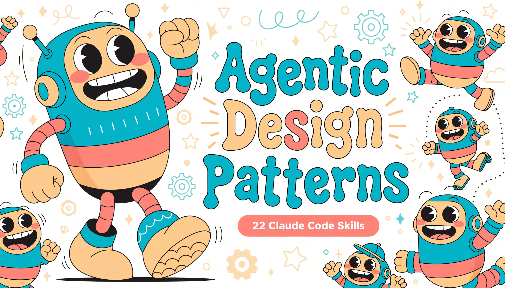

<p align="center">
  
</p>

# Agentic Design Pattern Skills

A complete set of **22 Agent Skills for Claude Code** (and any `SKILL.md`-compatible agent) covering the **21 agentic design patterns** from Antonio Gulli's *Agentic Design Patterns: A Hands-On Guide to Building Intelligent Systems*, plus a **router skill** that helps you pick the right pattern for a problem.

The set is built for **pattern selection**: every skill carries a selection-tuned `description` so the right pattern surfaces automatically when its problem appears, and the router (`agentic-pattern-selector`) handles the deliberate "I have a problem — which pattern fits?" case.

- 1 router skill + 21 pattern skills
- Framework-agnostic — the book's code uses LangChain/LangGraph, CrewAI, and Google ADK; these skills assume none of them
- Original distillation from a full read of the book — no copied prose, code, or figures
- MIT-licensed

## Contents

- [How skills work](#how-skills-work)
- [Install](#install)
- [How to invoke the skills](#how-to-invoke-the-skills)
- [The 22 skills](#the-22-skills)
- [Skill anatomy](#skill-anatomy)
- [Quick reference by chapter](#quick-reference-by-chapter)
- [Publishing](#publishing)
- [Attribution](#attribution)
- [License](#license)

## How skills work

A skill is a directory containing a `SKILL.md` file with YAML frontmatter (`name`, `description`) and a Markdown body. At startup, Claude pre-loads only the `name` and `description` of every installed skill; it reads the full body only when that skill becomes relevant (progressive disclosure). So you can install all 22 with negligible context cost — the `description` fields do the routing.

## Install

**Personal** (available across all your projects):

```bash
git clone https://github.com/albertoclemente/agentic-design-patterns-skills.git
cp -r agentic-design-patterns-skills/skills/* ~/.claude/skills/
```

**Project-scoped** (committed to one repo, shared with your team via git):

```bash
cp -r agentic-design-patterns-skills/skills/* /path/to/your/project/.claude/skills/
```

**Verify they're discovered:**

```bash
ls ~/.claude/skills/*/SKILL.md      # personal
ls .claude/skills/*/SKILL.md        # project
```

Notes:

- Project skills load from `.claude/skills/` in your starting directory and every parent directory up to the repository root.
- Claude Code watches skill directories: adding or editing a skill under an existing skills folder takes effect within the current session. Creating a brand-new top-level skills directory that did not exist at startup requires restarting Claude Code.
- Skills require the code-execution / Skill tool to be enabled — confirm `Skill` is among your allowed tools if a skill won't load.

### Install via `npx` (one command)

[`skills`](https://github.com/vercel-labs/skills) is an open agent-skills CLI (by Vercel Labs) that installs any public GitHub repo of skills into Claude Code and 40+ other agents. Because this repo uses the standard `skills/<name>/SKILL.md` layout, it installs with no extra packaging:

```bash
# Interactive (prompts for agent + scope)
npx skills add albertoclemente/agentic-design-patterns-skills

# Non-interactive: all skills, into Claude Code, global scope
npx skills add albertoclemente/agentic-design-patterns-skills --skill '*' -a claude-code -g -y

# List the skills in this repo without installing
npx skills add albertoclemente/agentic-design-patterns-skills --list

# Install just one (e.g. the router)
npx skills add albertoclemente/agentic-design-patterns-skills --skill agentic-pattern-selector -a claude-code
```

Manage them later with `npx skills list`, `npx skills update`, and `npx skills remove`. The CLI also writes a `skills-lock.json` so teammates can reproduce the same set.

> Note: `skills` is a community tool from Vercel Labs, not an official Anthropic installer, and GitHub-sourced skills are not security-scanned — review `SKILL.md` files before installing (these are plain instruction files, no executable scripts). The official Claude Code routes remain manual copy (above) and plugin marketplaces via `/plugin`.

## How to invoke the skills

There are two ways, once installed.

**Automatically.** Claude reads each skill's `description` at startup and loads the matching skill when your request fits it. Just describe your problem — for example, "my agent keeps failing when a tool call errors" surfaces `agentic-exception-handling`. The descriptions are tuned for exactly this.

**Explicitly, via slash command.** The skill's directory name becomes a slash command:

```
/agentic-pattern-selector      # open the router / decision guide
/agentic-reflection            # jump straight to one pattern
/agentic-tool-use
```

**Recommended entry point:** run `/agentic-pattern-selector` (or simply ask "which agentic pattern fits X?") and let it route you from symptom to pattern.

**Composition.** Skills can't import one another, but Claude can use several together automatically. The "Composes with" section in each skill is guidance for you and Claude — the composition itself happens naturally (e.g. planning + tool use + reflection + evaluation in one system).

## The 22 skills

### Router

- `agentic-pattern-selector` — symptom-to-pattern diagnostic covering all 21. Triggers when you're designing or refactoring an agent feature, or unsure which pattern applies.

### Structuring the work

- `agentic-prompt-chaining` (Ch. 1) — sequence of focused LLM calls (pipeline). Use when a task is too complex for one prompt and has distinct stages.
- `agentic-parallelization` (Ch. 3) — run independent sub-tasks concurrently. Use when work is I/O-bound and fans out.
- `agentic-routing` (Ch. 2) — classify input, dispatch to the right handler/model. Use when inputs are heterogeneous and need triage.
- `agentic-planning` (Ch. 6) — agent generates an adaptable multi-step plan. Use when the path isn't known up front.
- `agentic-prioritization` (Ch. 20) — rank competing tasks by urgency, importance, dependencies. Use when resources are constrained.
- `agentic-exploration-discovery` (Ch. 21) — probe an open-ended solution space (hypothesis -> critique -> evolve). Use when uncovering unknowns.

### Making the agent capable

- `agentic-tool-use` (Ch. 5) — function calling to fetch real data and take action. Use when breaking out of static model knowledge.
- `agentic-mcp` (Ch. 10) — standardized, discoverable tool/data integration. Use for scalable systems; for a small fixed tool set, plain tool use is enough.
- `agentic-knowledge-retrieval` (Ch. 14) — RAG: retrieve, ground, and cite. Use when answers must come from a corpus or private data.
- `agentic-reasoning-techniques` (Ch. 17) — CoT, ToT, ReAct, self-correction. Use when a problem needs explicit multi-step reasoning.

### Quality and reliability

- `agentic-reflection` (Ch. 4) — generate -> critique -> revise (Producer-Critic). Use when first-pass quality is inconsistent and checkable.
- `agentic-exception-handling` (Ch. 12) — detect, retry, fall back, recover. Use for agents calling fallible tools in production.
- `agentic-guardrails-safety` (Ch. 18) — layered input/output/tool/oversight controls. Use for untrusted input or real side effects.
- `agentic-evaluation-monitoring` (Ch. 19) — metrics, trajectory analysis, LLM-as-judge, drift detection. Use for anything you ship.
- `agentic-human-in-the-loop` (Ch. 13) — human checkpoints and escalation. Use for high-stakes, ambiguous, or irreversible decisions.

### State, scale, autonomy

- `agentic-memory-management` (Ch. 8) — short-term context plus long-term vector store. Use when continuity or recall is needed.
- `agentic-learning-adaptation` (Ch. 9) — improve from feedback over time. Use for evolving environments (framed around API-consumer levers, not weight training).
- `agentic-resource-aware-optimization` (Ch. 16) — Router + Critique + fallback to trade quality against cost. Use under budget or latency limits.
- `agentic-goal-setting-monitoring` (Ch. 11) — SMART goals plus progress tracking. Use for long-running autonomous tasks.

### Multiple agents

- `agentic-multi-agent` (Ch. 7) — ensemble of specialists (handoff / parallel / hierarchical / debate). Use when one agent is overloaded.
- `agentic-inter-agent-communication` (Ch. 15) — A2A protocol, Agent Cards. Use when agents across frameworks must coordinate.

## Skill anatomy

Every pattern skill follows the same structure, so they're predictable to scan:

- **What it is** — a one-paragraph definition
- **Reach for this when** — the selection signals (the symptoms)
- **Don't reach for this when** — anti-patterns and cheaper alternatives
- **Shape of the solution** — the mechanism, framework-agnostic
- **Common failure modes** — what tends to go wrong
- **Composes with** — pointers to neighboring pattern skills

The router skill instead contains a symptom-to-pattern index, decision heuristics, and a table of all 21 patterns.

## Quick reference by chapter

| Ch. | Pattern | Skill |
|----|---------|-------|
| 1 | Prompt Chaining | `agentic-prompt-chaining` |
| 2 | Routing | `agentic-routing` |
| 3 | Parallelization | `agentic-parallelization` |
| 4 | Reflection | `agentic-reflection` |
| 5 | Tool Use (Function Calling) | `agentic-tool-use` |
| 6 | Planning | `agentic-planning` |
| 7 | Multi-Agent Collaboration | `agentic-multi-agent` |
| 8 | Memory Management | `agentic-memory-management` |
| 9 | Learning and Adaptation | `agentic-learning-adaptation` |
| 10 | Model Context Protocol (MCP) | `agentic-mcp` |
| 11 | Goal Setting and Monitoring | `agentic-goal-setting-monitoring` |
| 12 | Exception Handling and Recovery | `agentic-exception-handling` |
| 13 | Human-in-the-Loop (HITL) | `agentic-human-in-the-loop` |
| 14 | Knowledge Retrieval (RAG) | `agentic-knowledge-retrieval` |
| 15 | Inter-Agent Communication (A2A) | `agentic-inter-agent-communication` |
| 16 | Resource-Aware Optimization | `agentic-resource-aware-optimization` |
| 17 | Reasoning Techniques | `agentic-reasoning-techniques` |
| 18 | Guardrails / Safety Patterns | `agentic-guardrails-safety` |
| 19 | Evaluation and Monitoring | `agentic-evaluation-monitoring` |
| 20 | Prioritization | `agentic-prioritization` |
| 21 | Exploration and Discovery | `agentic-exploration-discovery` |

## Publishing

This repository is ready to publish as-is. See [PUBLISH.md](PUBLISH.md) for the `gh` CLI one-liner and the manual create-on-web-then-push route. Before pushing, replace `<YOUR NAME>` in `LICENSE` and `albertoclemente` in this README.

## Attribution

The 21 patterns are the conceptual framework of **Antonio Gulli**, *Agentic Design Patterns: A Hands-On Guide to Building Intelligent Systems* (2025).

- **Free to read** (author's draft): https://docs.google.com/document/d/1rsaK53T3Lg5KoGwvf8ukOUvbELRtH-V0LnOIFDxBryE/
- **Print / ebook** (Springer / Amazon): all the author's royalties are donated to Save the Children — worth buying if these patterns earn their keep.

These skills are an **original distillation** — distilled from a full read of the book (each chapter's pattern overview, "At a Glance" box, and key takeaways), then rewritten for selection and auto-triggering inside Claude Code. They deliberately do **not** reproduce the book's prose, code, or figures — read the book itself for the full overviews, hands-on code examples, and takeaways.

## License

MIT — see [LICENSE](LICENSE). Applies to the skill files in this repository, not to the underlying book.
